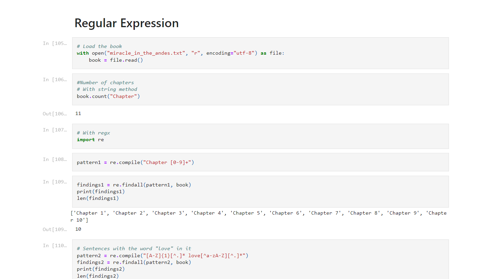
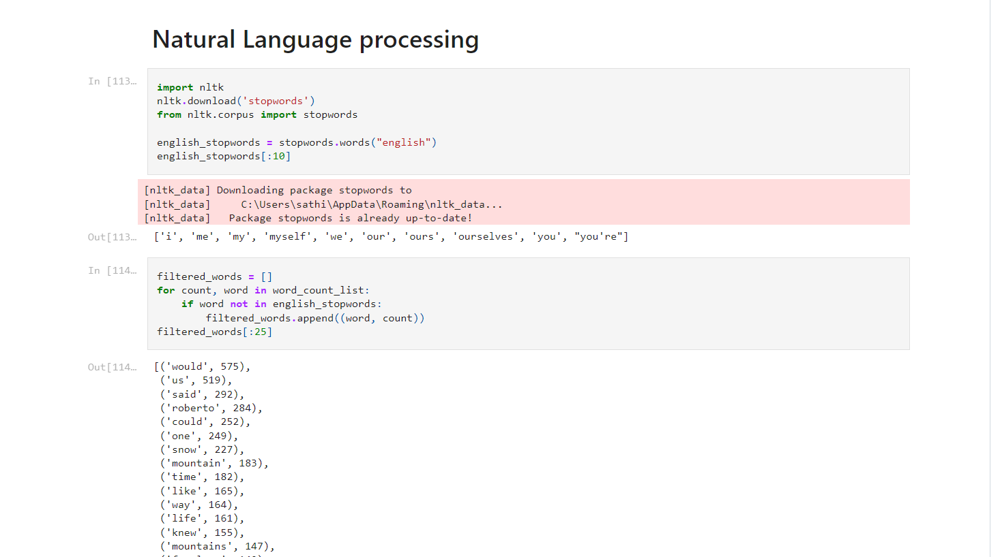

# 📚 Regex and Natural Language Processing for Ebooks

A Python project that demonstrates the use of **Regular Expressions (Regex)** and **Natural Language Processing (NLP)** to analyze text from ebooks. This project includes tasks like extracting chapters, finding sentences with specific words, and performing sentiment analysis on chapters.

---

## 🛠️ Features

- **Chapter Extraction**: Use regex to identify and split chapters in an ebook.
- **Word Analysis**: Find sentences containing specific words (e.g., "love") and analyze word frequency.
- **Stopword Filtering**: Remove common stopwords to focus on meaningful words.
- **Sentiment Analysis**: Analyze the sentiment of each chapter using NLP techniques.

---

## 🚦 How to Use

1. Install the required dependencies (`nltk`, `pandas`, and `regex`).
2. Load the ebook text file and run the provided scripts.
3. Use the functions to extract chapters, analyze word frequency, and perform sentiment analysis.

---

## 📸 Screenshots

---

## 📬 Contact

Feel free to explore the project and share your feedback. For any inquiries, suggestions, or contributions, reach out to me at **sathiyanarayanan.s1698@gmail.com**.
